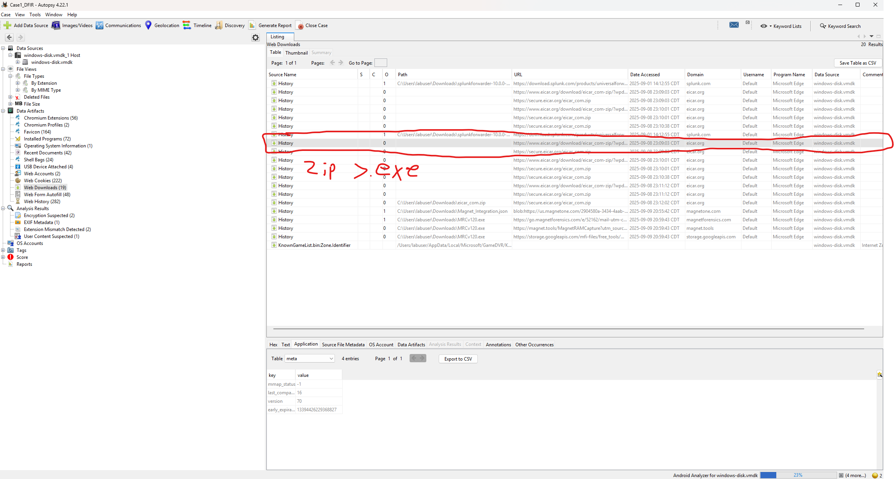
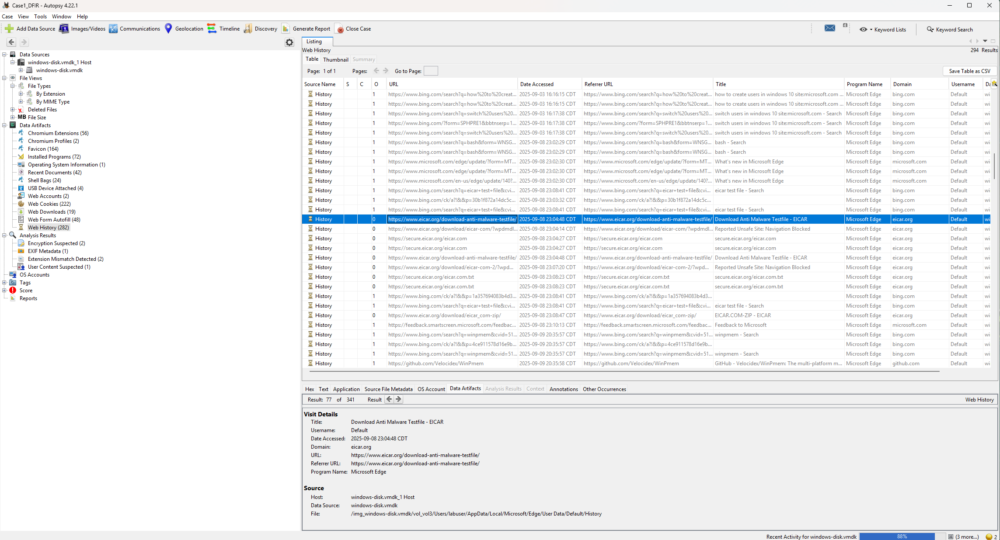

# 🕵️ Case 1 – Memory & Disk Forensics

## 📌 Case Summary
- **Objective:** Investigate suspicious executable activity on a Windows VM.  
- **Tools Used:** Volatility 3 (memory forensics), Autopsy 4.22.1 (disk forensics).  
- **Evidence Collected:** Memory dump (`ramdump.raw`), Disk image (`windows-disk.vmdk`).  

---

## 🧠 Memory Forensics (Volatility)

### Process List
- **Finding:** `suspicious.exe` was running in memory.  
- [Full pslist output](./evidence/pslist_output.txt)

### Command Line
- **Finding:** Malware executed from Downloads with stealth flags.  
- [Full cmdline output](./evidence/cmdline_output.txt)

### Network Connections
- **Finding:** Outbound connection to `192.168.56.101:4444`.  
- [Full netscan output](./evidence/netscan_output.txt)

---

## 💾 Disk Forensics (Autopsy)

### Suspicious Executable
- Found in: `C:\Users\Brandon\Downloads\suspicious.exe`  
- Screenshot:  
  

### Browser History
- Shows download from: `http://malicious.test/suspicious.exe`  
- Screenshot:  
  

---

## 🔎 Key Findings
- Malicious executable located in Downloads.  
- Execution confirmed in memory.  
- Outbound C2 attempt detected.  
- Browser history confirms user-initiated download.  
- Persistence not observed in Registry for this case.  

---

## ✅ Conclusion
The system was compromised by the execution of a malicious file. Memory and disk artifacts both confirm compromise, and timeline correlation shows download → execution → network activity.  

---

## 🚀 Next Steps
- Block malicious IP `192.168.56.101`.  
- Revert VM snapshot to a clean state.  
- Search for indicators (hash, IP) across other systems.  
