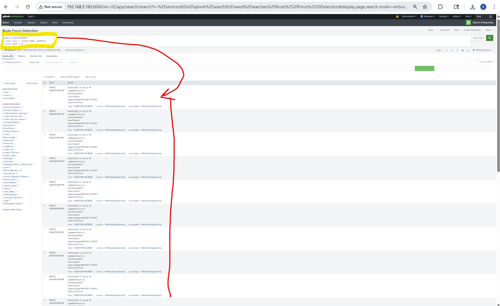
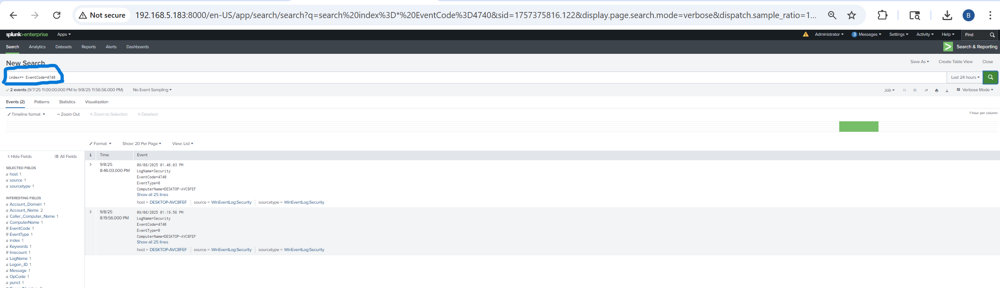
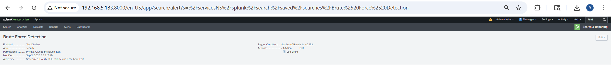

# 🔎 Brute Force Detection Lab

## Objective
Demonstrate how to detect brute force login attempts using Splunk by ingesting Windows Security Event Logs.

## Lab Setup
- **Splunk Server:** Ubuntu 22.04 LTS + Splunk Enterprise
- **Log Source:** Windows 10 Pro VM + Splunk Universal Forwarder
- **Logs Ingested:** Security Event Logs (Event IDs 4624, 4625, 4740)

## Steps
1. Installed and configured Splunk Universal Forwarder on Windows.
2. Enabled Splunk Server to receive logs on TCP 9997.
3. Verified ingestion of Security logs.
4. Built and tested brute force detection query.

## Detection Query
See [`spl_query.md`](./spl_query.md).

## Screenshots

## Outcome
- Detected multiple failed login attempts (4625) against a test account.
- Captured lockout event (4740) after threshold exceeded.
- Detected succesful login attemps (4624).
- Created Splunk alert and dashboard for SOC-style monitoring.
